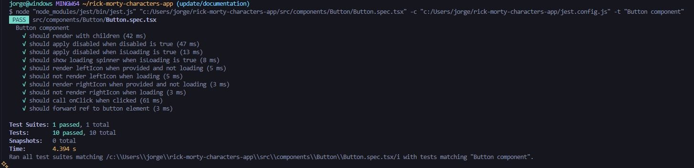

# Rick & Morty Characters App

Esta es una aplicación creada con [Next.js](https://nextjs.org) usando [`create-next-app`](https://nextjs.org/docs/app/api-reference/cli/create-next-app).

Permite explorar personajes de Rick & Morty con filtrado, paginación, historial de personajes recientes y gestión de estado global mediante Redux.

## Funcionalidades

- Listado de todos los personajes con paginación.
- Filtrado de personajes por nombre en tiempo real.
- Visualización de detalles de cada personaje.
- Seguimiento de los últimos 5 personajes visitados usando `localStorage`.
- Gestión global del estado con Redux para la lista de personajes y detalles individuales.
- Componentes reutilizables: `Button`, `Card`, `Input`, `LinkButton`.
- Tipado completo con `TypeScript`.
- Pruebas unitarias con `Jest` y `React Testing Library`.

## Cómo empezar

Para instalar el repositorio escoja: SSH o HTTPS
```bash
git clone git@gitlab.com:jpachecox/rick-morty-characters-app
```
```bash
git clone https://github.com/jpachecox/rick-morty-characters-app
```

Ir al directorio del proyecto
```bash
cd rick-morty-characters-app
```

Instalar dependencias
```bash
npm install
```

Ejecutar el proyecto en local:
```bash
npm run dev
```

## Estructura de los Módulos

La aplicación sigue una arquitectura de módulos inspirada en Laravel, con enfoque en escalabilidad y separación de responsabilidades. Esta estructura permite mantener un código organizado, reutilizable y fácil de mantener, especialmente cuando se requiere un boundex context específico para diferentes funcionalidades.

### Estructura Base del Proyecto

```
rick-morty-characters-app/
├─ src/
│  ├─ features/            # Módulos de funcionalidad
│  │  ├─ characters/       # Módulo de personajes
│  │  │  ├─ components/    # Componentes específicos del módulo
│  │  │  ├─ hooks/         # Hooks personalizados (useCharacters, useCharacter)
│  │  │  ├─ services/      # Servicios de API específicos del módulo
│  │  │  └─ types/         # Tipos de dominio específicos
│  │  └─ [feature_name]/   # Futuros módulos siguiendo la misma estructura
│  ├─ shared/              # Utilidades y tipos compartidos
│  │  ├─ components/       # Componentes compartidos globalmente
│  │  │  ├─ Button/        # Componente Button reutilizable
│  │  │  ├─ Input/         # Componente Input reutilizable  
│  │  │  ├─ Card/          # Componente Card reutilizable
│  │  │  └─ LinkButton/    # Componente LinkButton reutilizable
│  │  ├─ constants/        # Constanstes globales de la aplicación
│  │  ├─ types/            # Tipos globales de la aplicación
│  │  └─ utils/            # Funciones utilitarias
│  ├─ store/               # Configuración del store de Redux
│  ├─ api/                 # Configuración del APi
│  └─ app/                 # Páginas de Next.js (App Router)
├─ public/                 # Archivos estáticos
├─ docs/                   # Documentación adicional
│  └─ screenshots/         # Capturas de pantalla de tests y aplicación
│     ├─ button-test.png
│     ├─ card-test.png
│     ├─ input-test.png
│     └─ linkbutton-test.png
└─ README.md
```

### Estructura Detallada Features

```
src/features/[feature_name]/
├─ components/             # Componentes propios del Feature
├─ hooks/                  # Hooks propios del Feature
├─ services/               # Services propios del Feature
└─ types/                  # Types propios del Feature
```

### Principios de la Arquitectura

**Separación por Dominio**: Cada módulo encapsula toda la lógica relacionada con un dominio específico, facilitando el mantenimiento y la escalabilidad.

**Reutilización de Componentes**: Los componentes en `src/shared/components/` están diseñados para ser reutilizables en cualquier parte de la aplicación.

**Gestión de Estado Modular**: Cada módulo maneja su propio estado a través de slices de Redux, manteniendo la separación de responsabilidades.

**Tipado Estricto**: TypeScript garantiza la consistencia y previene errores en tiempo de desarrollo.

**Testing Integrado**: Cada componente incluye pruebas unitarias para asegurar la calidad del código.

### Variables de Entorno

Para configurar el proyecto correctamente, es necesario establecer las variables de entorno requeridas:

### Configuración Inicial

1. Copia el archivo de ejemplo:
```bash
cp .env.local.example .env.local
```

2. Edita el archivo `.env.local` y configura las siguientes variables:

### Variables Requeridas

| Variable                 | Descripción                         | Ejemplo                              |
|--------------------------|-------------------------------------|--------------------------------------|
| NEXT_PUBLIC_API_URL      | URL base de la API                  | https://rickandmortyapi.com/api    |
| NEXT_PUBLIC_APP_NAME     | Nombre del App | Rick & Morty Characters App                               |
| NEXT_PUBLIC_ITEMS_PER_PAGE     | Número de personajes por página en la paginación. | 20                               |
| NEXT_PUBLIC_MAX_RECENT_CHARACTERS     | Máximo número de personajes en el historial reciente. | 5                               |

### Notas Importantes

- Las variables que comienzan con `NEXT_PUBLIC_` están disponibles en el cliente (browser).
- Nunca commits el archivo `.env.local` al repositorio por seguridad.
- Para producción, configura estas variables en tu plataforma de hosting.

### Scripts Disponibles

```bash
npm run dev          # Ejecuta la aplicación en modo desarrollo
npm run build        # Construye la aplicación para producción
npm run start        # Inicia la aplicación en modo producción
npm run lint         # Ejecuta el linter
npm run test         # Ejecuta las pruebas unitarias
npm run test:watch   # Ejecuta las pruebas en modo watch
```

### Recursos

- [Next.js Documentation](https://nextjs.org/docs)
- [Redux Toolkit](https://redux-toolkit.js.org/)
- [React Testing Library](https://testing-library.com/docs/react-testing-library/intro/)
- [Jest](https://jestjs.io/)
- [TypeScript](https://www.typescriptlang.org/docs/)
- [clsx](https://github.com/lukeed/clsx)
- [Rick & Morty API](https://rickandmortyapi.com/documentation)

### Pruebas Unitarias

La aplicación cuenta con un sistema de pruebas unitarias robusto implementado con **Jest** y **React Testing Library**, garantizando la calidad y confiabilidad del código.

#### Configuración de Testing

El entorno de pruebas está configurado a través de dos archivos principales:

**`jest.config.js`**
- Configuración principal de Jest adaptada para Next.js
- Configuración de módulos y transformaciones TypeScript
- Mapeo de paths y aliases del proyecto
- Configuración de entorno de testing para componentes React

**`jest.setup.ts`**
- Configuración inicial que se ejecuta antes de cada test
- Configuración de React Testing Library
- Mocks globales y utilidades de testing
- Configuración de jsdom para simular el entorno del navegador

#### Screenshots de pruebas unitarias

**`Button`**

**`Card`**

**`Input`**

**`Linkbutton`**
